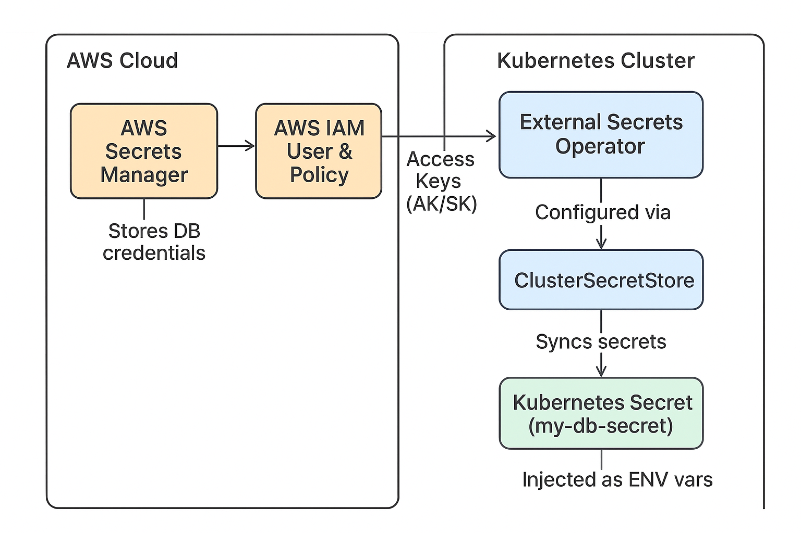

# External Secrets Implementation Flow in Kubernetes  
### Using AWS Secrets Manager with External Secrets Operator (ESO)

---

## 📖 Overview
The **External Secrets Operator (ESO)** allows you to synchronize secrets from **AWS Secrets Manager** into **Kubernetes** seamlessly.  

This guide covers:  
- Installing External Secrets Operator  
- Configuring AWS credentials for ESO  
- Storing secrets in AWS Secrets Manager  
- Creating `ExternalSecret` resources to inject AWS secrets into Kubernetes  

---

## 🛠️ 1. Install External Secrets Operator
Install ESO using **Helm**:

```bash
helm repo add external-secrets https://charts.external-secrets.io
helm repo update
helm install external-secrets external-secrets/external-secrets   --namespace external-secrets --create-namespace
```

Verify installation:

```bash
kubectl get pods -n external-secrets
```

---

## 🔑 2. Create an AWS IAM User for ESO

### 2.1 Create an IAM Policy
Save the following policy as **`eso-secrets-policy.json`**:

```json
{
  "Version": "2012-10-17",
  "Statement": [
    {
      "Effect": "Allow",
      "Action": [
        "secretsmanager:GetSecretValue",
        "secretsmanager:DescribeSecret",
        "secretsmanager:ListSecrets"
      ],
      "Resource": "arn:aws:secretsmanager:your-region:your-account-id:secret:*"
    }
  ]
}
```

Create the policy:

```bash
aws iam create-policy --policy-name ESOSecretsPolicy --policy-document file://eso-secrets-policy.json
```

### 2.2 Generate Access Keys
Create access keys for the IAM user:

```bash
aws iam create-access-key --user-name eso-user
```

Copy the **Access Key ID** and **Secret Access Key**.

---

## 🔐 3. Store Secrets in AWS Secrets Manager
Store database credentials:

```bash
aws secretsmanager create-secret --name my-db-secret   --secret-string '{"username":"dbuser","password":"dbpassword","host":"dbhost","port":"5432"}'
```

---

## 📦 4. Create a Kubernetes Secret for AWS Credentials
Create a **Kubernetes Secret** to store AWS credentials:

```yaml
apiVersion: v1
kind: Secret
metadata:
  name: aws-secret
  namespace: external-secrets
type: Opaque
data:
  access-key: <base64-encoded-access-key>
  secret-key: <base64-encoded-secret-key>
```

Encode the keys:

```bash
echo -n "your-access-key" | base64
echo -n "your-secret-key" | base64
```

Apply the secret:

```bash
kubectl apply -f aws-secret.yaml
```

---

## 📄 5. Create a ClusterSecretStore
Define how ESO connects to AWS Secrets Manager:

```yaml
apiVersion: external-secrets.io/v1beta1
kind: ClusterSecretStore
metadata:
  name: aws-secret-store
spec:
  provider:
    aws:
      service: SecretsManager
      region: your-region
      auth:
        secretRef:
          accessKeyIDSecretRef:
            name: aws-secret
            key: access-key
            namespace: external-secrets
          secretAccessKeySecretRef:
            name: aws-secret
            key: secret-key
            namespace: external-secrets
```

Apply it:

```bash
kubectl apply -f cluster-secret-store.yaml
```

---

## 🔄 6. Create an External Secret
Define the **ExternalSecret** that syncs the AWS secret into Kubernetes:

```yaml
apiVersion: external-secrets.io/v1beta1
kind: ExternalSecret
metadata:
  name: my-db-secret
  namespace: default
spec:
  refreshInterval: 1h
  secretStoreRef:
    name: aws-secret-store
    kind: ClusterSecretStore
  target:
    name: my-db-secret
  data:
    - secretKey: username
      remoteRef:
        key: my-db-secret
        property: username
    - secretKey: password
      remoteRef:
        key: my-db-secret
        property: password
    - secretKey: host
      remoteRef:
        key: my-db-secret
        property: host
    - secretKey: port
      remoteRef:
        key: my-db-secret
        property: port
```

Apply it:

```bash
kubectl apply -f external-secret.yaml
```

---

## ✅ 7. Verify the Secret Sync
Check if the secret was created in Kubernetes:

```bash
kubectl get secrets my-db-secret
```

Decode the values:

```bash
kubectl get secret my-db-secret -o jsonpath='{.data.username}' | base64 --decode
kubectl get secret my-db-secret -o jsonpath='{.data.password}' | base64 --decode
```

---

## 🚀 8. Update Your Application Deployment
Use the synced secret in your application:

```yaml
env:
  - name: DB_USERNAME
    valueFrom:
      secretKeyRef:
        name: my-db-secret
        key: username
  - name: DB_PASSWORD
    valueFrom:
      secretKeyRef:
        name: my-db-secret
        key: password
  - name: DB_HOST
    valueFrom:
      secretKeyRef:
        name: my-db-secret
        key: host
  - name: DB_PORT
    valueFrom:
      secretKeyRef:
        name: my-db-secret
        key: port
```

Apply your deployment:

```bash
kubectl apply -f my-app-deployment.yaml
```

---

## 🔎 Architecture Flow Diagram



---

## 🎯 Conclusion
With **External Secrets Operator**, Kubernetes applications can securely fetch secrets from **AWS Secrets Manager**, ensuring centralized secret management and reduced security risks.
